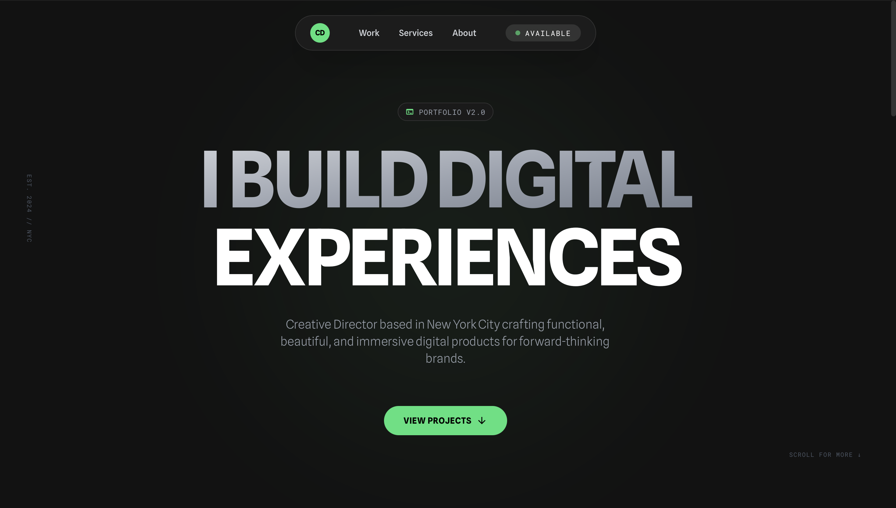

# Creative Director Portfolio

<div align="center">
  
  
  <br />

  
  
  
  
 
</div>

<br />

## ⚡ About The Project
A modern, dark-themed portfolio web application designed for a Creative Director. Built with React.js, Vite, and Tailwind CSS, it features high-performance animations, a responsive layout, and a sleek design ensuring a premium user experience to showcase creative work and services.

## ✨ Key Features
* 🎯 **Dynamic Hero & Navigation :** An immersive landing section with a responsive navigation bar and smooth scrolling capabilities.
* 🚀 **Services Ticker :** An animated, marquee-style ticker component that highlights the range of services offered in a visually engaging way.
* 🎨 **Project Showcase :** A dedicated Work Section to display portfolio projects with a focus on visual impact and typography.

## 🛠️ Built With
* **Front-end :** React, TypeScript, Vite, Tailwind CSS
* **Back-end :** None (Static/SPA)

## 🚀 Getting Started
```bash
# Clone the repo
git clone https://github.com/Mid0o03/portfolio_creativeDirector.git

# Install dependencies
npm install

# Run the server
npm run dev
```
